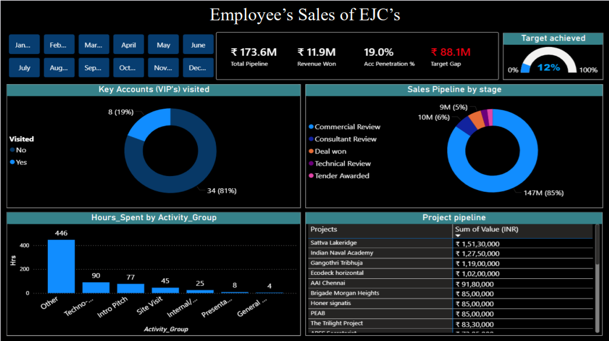
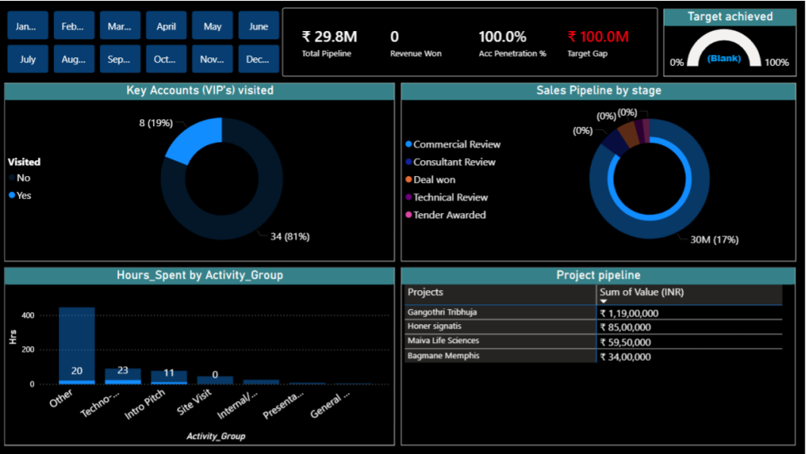

# 📊 Employee Sales Analysis – EJC Covers (Power BI)

**Tags:**  
`power-bi` `sales-analytics` `business-intelligence` `dashboard` `data-analysis` `crm-analytics`

---

This project analyzes **employee-level sales performance and sales pipeline efficiency** for **EJC Covers** using **Power BI**.  
The dashboard helps identify **conversion bottlenecks, inefficient time usage, poor key account coverage**, and provides **actionable recommendations** to improve revenue realization.

---

## 🎯 Project Objective

To evaluate how employee sales activities translate into actual revenue and identify gaps in:
- Sales pipeline conversion  
- Time utilization  
- Key account focus  
- Target achievement  

The goal is to move from **high activity** to **high effectiveness**.

---

## 🧾 Dataset Overview

The dataset includes:
- Sales pipeline value by stage  
- Revenue won vs target  
- Key account (VIP) visit status  
- Time spent by activity type  
- Project-wise pipeline value  

> All data is used for **analytical and learning purposes**.

---

## 🛠 Tools Used

- **Power BI Desktop**
- **Power Query** – data cleaning & transformation
- **DAX** – KPI calculations and measures
- **Excel / CSV** – source data

---

## 📈 Dashboard Highlights

### Key KPIs
- **Total Sales Pipeline:** ₹17.36 Cr  
- **Revenue Won:** ₹1.19 Cr  
- **Target Achieved:** 12%  
- **Account Penetration:** 19%  

### Key Visuals
- Sales pipeline by stage (Commercial Review, Deal Won, etc.)
- Time spent by activity group
- Key account (VIP) visit analysis
- Project-level pipeline value table

---

## 🖼 Dashboard Screenshots

### Dashboard Overview 

### Key Account Analysis

---

## 🔍 Key Insights

- **85% of pipeline value** is stuck in the *Commercial Review* stage  
- **446 out of 695 hours** logged under non-justified activities  
- Only **8 out of 42 key accounts** were visited  
- **0% active deals** originated from official key accounts  
- High activity does **not** translate into proportional revenue

---

## 💡 Recommendations Derived

- Prioritize **Key Accounts** over random leads  
- Increase **on-site mockups and technical demonstrations**  
- Conduct **regular pipeline reviews** for high-value deals  
- Improve **CRM discipline** by mapping time spent to projects  
- Shift focus from volume of leads to **conversion quality**

---

## 🎥 Dashboard Walkthrough

A detailed dashboard explanation and insight walkthrough is available here:  
🔗 https://youtu.be/4_3jwgBrjtg

---

## 📌 Author

**Shreyas Auti**  
📧 shreyas.9auti@gmail.com  
🔗 LinkedIn: https://linkedin.com/in/shreyas-auti-301a21175  
🐙 GitHub: https://github.com/shreyas-auti  
